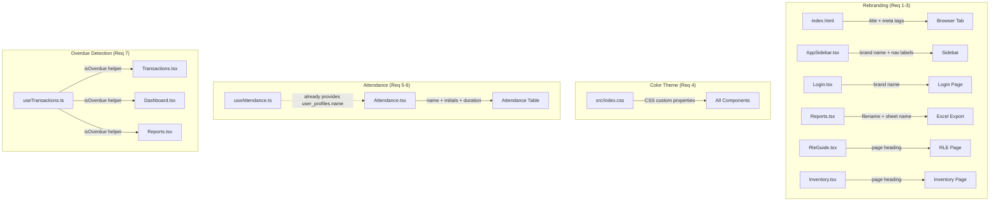

# Design Document

## Overview

This design covers seven client-requested revisions to the NUF - CHS Inventory system (formerly LabTrack). The changes span four categories:

1. **Rebranding** (Requirements 1–3): Replace "LabTrack" with "NUF - CHS Inventory" across all visible surfaces, rename "RLE Guide" to "RLE Procedure", and rename "Inventory" to "Inventory/Borrowing".
2. **Color theme** (Requirement 4): Shift the entire HSL-based color scheme from the current green (hue 142) to dark jungle green (#1A2421, approximately HSL 150° 16% 12%).
3. **Attendance enhancements** (Requirements 5–6): Display actual SA names with dynamic initials and calculate elapsed duration from `time_in`/`time_out`.
4. **Client-side overdue detection** (Requirement 7): Derive overdue status in the browser by comparing `due_date` against today's date for "approved" transactions, applied consistently across Transactions, Dashboard, and Reports pages.

All changes are purely client-side — no database schema changes, no new API endpoints, no new Supabase queries. The `useAttendance` hook already joins `user_profiles(name)`, and the `useTransactions` hook already fetches `due_date` and `status`.

## Architecture

The existing architecture remains unchanged. The app is a single-page React + TypeScript application built with Vite, using Supabase as the backend, Tailwind CSS for styling, and shadcn/ui for component primitives. CSS custom properties are defined in HSL format in `src/index.css` and consumed via Tailwind's `hsl(var(--...))` pattern in `tailwind.config.ts`.

### Change Impact Diagram



## Components and Interfaces

### Requirement 1–3: Rebranding (Static Text Changes)

These are straightforward string replacements with no new components or interfaces.

| File | Current Value | New Value |
|---|---|---|
| `index.html` `<title>` | `LabTrack - Laboratory Inventory Management System` | `NUF - CHS Inventory` |
| `index.html` og/twitter meta | `LabTrack - Laboratory Inventory Management System` | `NUF - CHS Inventory` |
| `index.html` meta description | `LabTrack - Laboratory Inventory Management System for Clinical Health Sciences` | `NUF - CHS Inventory - Laboratory Inventory Management System` |
| `AppSidebar.tsx` brand `<h1>` | `LabTrack` | `NUF - CHS Inventory` |
| `AppSidebar.tsx` brand `<p>` | `CHS Inventory` | *(remove subtitle — brand name now includes it)* |
| `AppSidebar.tsx` nav item label | `Inventory` | `Inventory/Borrowing` |
| `AppSidebar.tsx` nav item label | `RLE Guide` | `RLE Procedure` |
| `Login.tsx` desktop `<h1>` | `LabTrack` | `NUF - CHS Inventory` |
| `Login.tsx` desktop `<p>` | `CHS Inventory System` | *(remove subtitle — brand name now includes it)* |
| `Login.tsx` mobile `<span>` | `LabTrack` | `NUF - CHS Inventory` |
| `Reports.tsx` filename | `LabTrack_Report_${timestamp}.xlsx` | `NUF_CHS_Inventory_Report_${timestamp}.xlsx` |
| `Reports.tsx` sheet name | `LabTrack Report` | `NUF - CHS Inventory Report` |
| `RleGuide.tsx` heading | `RLE Guide` | `RLE Procedure` |
| `RleGuide.tsx` subtitle | `Related Learning Experience guides for all year levels` | `Related Learning Experience procedures for all year levels` |
| `Inventory.tsx` heading | `Inventory` | `Inventory/Borrowing` |

### Requirement 4: Color Theme Update

The dark jungle green reference color is **#1A2421** (HSL ≈ 150° 16% 12%). All CSS custom properties currently using hue 142 will shift to hue 150 with adjusted saturation to match the dark jungle green family. The approach:

- **Sidebar variables**: Use the exact dark jungle green values (150° hue, low saturation, low lightness) since the sidebar is the darkest surface.
- **Primary/accent**: Shift to hue 150 with moderate saturation for interactive elements.
- **Secondary/muted/border**: Shift to hue 150 with low saturation for subtle backgrounds.
- **Warning, info, destructive**: Preserved exactly as-is per Requirement 4.5.

Updated CSS custom properties:

```css
:root {
    --background: 200 20% 98%;
    --foreground: 200 25% 10%;

    --card: 0 0% 100%;
    --card-foreground: 200 25% 10%;

    --popover: 0 0% 100%;
    --popover-foreground: 200 25% 10%;

    --primary: 150 40% 30%;
    --primary-foreground: 0 0% 100%;

    --secondary: 150 12% 94%;
    --secondary-foreground: 150 20% 15%;

    --muted: 150 10% 93%;
    --muted-foreground: 150 8% 46%;

    --accent: 150 40% 38%;
    --accent-foreground: 0 0% 100%;

    --destructive: 0 72% 51%;
    --destructive-foreground: 0 0% 100%;

    --border: 150 12% 88%;
    --input: 150 12% 88%;
    --ring: 150 40% 30%;

    --radius: 0.5rem;

    --sidebar-background: 150 16% 12%;
    --sidebar-foreground: 150 8% 85%;
    --sidebar-primary: 150 40% 38%;
    --sidebar-primary-foreground: 0 0% 100%;
    --sidebar-accent: 150 14% 18%;
    --sidebar-accent-foreground: 150 8% 85%;
    --sidebar-border: 150 12% 22%;
    --sidebar-ring: 150 40% 38%;

    --success: 150 40% 30%;
    --success-foreground: 0 0% 100%;
    --warning: 38 92% 50%;
    --warning-foreground: 0 0% 10%;
    --info: 205 78% 52%;
    --info-foreground: 0 0% 100%;
}
```

Design rationale:
- `--sidebar-background: 150 16% 12%` maps directly to #1A2421 (the exact dark jungle green).
- Primary and accent use hue 150 with higher saturation (40%) and moderate lightness for visibility on white backgrounds.
- Secondary/muted/border use hue 150 with very low saturation to stay neutral.
- Warning (38°), info (205°), destructive (0°) are untouched.

### Requirement 5: SA Name Display on Attendance Page

The `useAttendance` hook already fetches `user_profiles(name)` via the Supabase join. The `AttendanceRecord` interface already includes `user_profiles?: { name: string }`. Changes are isolated to `Attendance.tsx`:

**Name display logic:**
```typescript
const saName = record.user_profiles?.name ?? "Student Assistant";
```

**Initials logic:**
```typescript
function getInitials(name: string): string {
  return name.split(/\s+/).map(word => word[0]).join("").toUpperCase();
}

const initials = record.user_profiles?.name
  ? getInitials(record.user_profiles.name)
  : "SA";
```

### Requirement 6: Duration Calculation on Attendance Page

A pure function `formatDuration` will be added to `Attendance.tsx` (or extracted to a utility if reuse is needed):

```typescript
function formatDuration(timeIn: string, timeOut: string | null): string {
  if (!timeOut) return "—";

  const [inH, inM] = timeIn.split(":").map(Number);
  const [outH, outM] = timeOut.split(":").map(Number);
  const totalMinutes = (outH * 60 + outM) - (inH * 60 + inM);

  if (totalMinutes < 0) return "—";
  if (totalMinutes < 60) return `${totalMinutes}m`;

  const hours = Math.floor(totalMinutes / 60);
  const minutes = totalMinutes % 60;
  return minutes > 0 ? `${hours}h ${minutes}m` : `${hours}h`;
}
```

The time values from Supabase are stored in `HH:MM` 24-hour format (set by `toLocaleTimeString("en-US", { hour12: false, hour: "2-digit", minute: "2-digit" })`), so simple string splitting is reliable.

### Requirement 7: Client-Side Overdue Detection

**Core helper function** — exported from `useTransactions.ts`:

```typescript
export function isOverdue(transaction: { status: string; due_date: string }): boolean {
  if (transaction.status !== "approved") return false;
  const today = new Date().toISOString().split("T")[0];
  return transaction.due_date < today;
}
```

This uses ISO date string comparison (`YYYY-MM-DD`), which is lexicographically correct for date ordering.

**Effective status derivation** — used in display logic:

```typescript
export function getEffectiveStatus(transaction: Transaction): string {
  return isOverdue(transaction) ? "overdue" : transaction.status;
}
```

**Consumers:**

| File | Current Logic | New Logic |
|---|---|---|
| `Transactions.tsx` | Displays `tx.status` directly | Displays `getEffectiveStatus(tx)` |
| `Transactions.tsx` filter | Filters on `tx.status` | Overdue filter uses `isOverdue(tx)` for "approved" items past due |
| `Dashboard.tsx` | `transactions.filter(t => t.status === "overdue").length` | `transactions.filter(isOverdue).length` |
| `Reports.tsx` overdue count | `transactions.filter(t => t.status === "overdue").length` | `transactions.filter(isOverdue).length` |
| `Reports.tsx` Excel "Overdue Items" row | Same as above | Same `isOverdue` filter |

## Data Models

No data model changes are required. The existing interfaces are sufficient:

**`AttendanceRecord`** (from `useAttendance.ts`):
```typescript
interface AttendanceRecord {
  id: string;
  user_id: string;
  date: string;
  time_in: string;        // "HH:MM" 24-hour format
  time_out: string | null; // "HH:MM" 24-hour format or null
  created_at: string;
  user_profiles?: { name: string };
}
```

**`Transaction`** (from `useTransactions.ts`):
```typescript
interface Transaction {
  id: string;
  user_id: string;
  item_id: string;
  type: "borrow" | "return" | "reserve";
  status: "pending" | "approved" | "returned" | "overdue" | "rejected";
  quantity: number;
  borrow_date: string;    // "YYYY-MM-DD"
  due_date: string;       // "YYYY-MM-DD"
  return_date: string | null;
  created_at: string;
  updated_at: string;
  user_profiles?: { name: string; email: string; ci_id: string | null };
  inventory_items?: { name: string; location: string };
}
```

Both interfaces already contain all fields needed for the new features. The `user_profiles.name` join is already fetched by `useAttendance`, and `due_date` + `status` are already available on `Transaction`.

## Correctness Properties

*A property is a characteristic or behavior that should hold true across all valid executions of a system — essentially, a formal statement about what the system should do. Properties serve as the bridge between human-readable specifications and machine-verifiable correctness guarantees.*

### Property 1: Initials extraction produces first letter of each word

*For any* non-empty name string consisting of one or more whitespace-separated words, `getInitials(name)` SHALL return a string whose length equals the number of words and whose characters are the uppercase first letter of each word in order.

**Validates: Requirements 5.2**

### Property 2: Duration formatting correctness

*For any* valid 24-hour time pair `(timeIn, timeOut)` where `timeOut >= timeIn`, `formatDuration(timeIn, timeOut)` SHALL return a string that:
- When the difference is less than 60 minutes: matches the format `"{M}m"` where M is the exact minute difference
- When the difference is 60 minutes or more with zero remainder minutes: matches the format `"{H}h"` where H is the exact hour count
- When the difference is 60 minutes or more with non-zero remainder: matches the format `"{H}h {M}m"` where H and M are the exact hour and minute components

And in all cases, parsing the returned string back into total minutes SHALL equal `(outH * 60 + outM) - (inH * 60 + inM)`.

**Validates: Requirements 6.1, 6.3, 6.4**

### Property 3: Overdue detection correctness

*For any* transaction object with a `status` and `due_date` (in YYYY-MM-DD format), `isOverdue(transaction)` SHALL return `true` if and only if `status === "approved"` AND `due_date < today` (ISO date string comparison). For all other statuses ("pending", "returned", "rejected", "overdue") or when `due_date >= today`, it SHALL return `false`.

**Validates: Requirements 7.1, 7.2, 7.3, 7.4, 7.5**

## Error Handling

### Attendance Name Fallback (Requirement 5.3)
When `record.user_profiles` is `undefined` or `record.user_profiles.name` is falsy, the Attendance page falls back to displaying "Student Assistant" as the label and "SA" as the avatar initials. This uses nullish coalescing (`??`) for safe access.

### Duration Edge Cases (Requirement 6.2)
- `time_out` is `null`: Display "—" (em dash)
- Calculated duration is negative (data inconsistency): Display "—"
- Both handled by the `formatDuration` function returning "—" for invalid inputs

### Overdue Detection Edge Cases
- `due_date` is exactly today: NOT overdue (requirement 7.2 specifies "today or in the future" remains approved)
- Transaction status is already "overdue" in the database: `isOverdue` returns `false` because `status !== "approved"` — the database status takes precedence. The `getEffectiveStatus` function only upgrades "approved" to "overdue", never downgrades.
- Transaction status is "returned", "rejected", or "pending": `isOverdue` returns `false` regardless of `due_date`

### No-Op Scenarios
- Requirements 1–4 involve static text and CSS changes with no runtime error paths
- If the Supabase join fails to return `user_profiles`, the existing `?` optional chaining in the codebase already handles this gracefully

## Testing Strategy

### Unit Tests (Example-Based)

**Rebranding verification** (Requirements 1–3):
- Snapshot or string-match tests verifying the correct brand name appears in each file
- These are best validated during code review and CI build checks rather than runtime tests

**CSS theme verification** (Requirement 4):
- Parse `src/index.css` and assert that all green-family variables use hue 150
- Assert that `--warning`, `--info`, and `--destructive` values are unchanged
- Assert `--sidebar-background` maps to approximately #1A2421

**Attendance fallback** (Requirement 5.3):
- Example test: `getInitials` with undefined input falls back to "SA"
- Example test: name display with undefined `user_profiles` shows "Student Assistant"

**Duration edge cases** (Requirement 6.2):
- Example test: `formatDuration("08:00", null)` returns "—"
- Example test: `formatDuration("18:00", "08:00")` returns "—" (negative duration)

**Overdue consistency** (Requirements 7.4, 7.5):
- Example test: Given a known set of transactions, Dashboard and Reports overdue counts match

### Property-Based Tests

Property-based tests use `fast-check` (compatible with Vitest) with a minimum of 100 iterations per property.

**Property 1: Initials extraction** — Generate random name strings (1–5 words, various casing), verify `getInitials` output length and character correctness.
- Tag: `Feature: client-revisions-v2, Property 1: Initials extraction produces first letter of each word`

**Property 2: Duration formatting** — Generate random valid HH:MM pairs where out >= in, verify format correctness and round-trip minute count.
- Tag: `Feature: client-revisions-v2, Property 2: Duration formatting correctness`

**Property 3: Overdue detection** — Generate random transaction objects with varied statuses and due_dates (past, today, future), verify `isOverdue` returns the correct boolean.
- Tag: `Feature: client-revisions-v2, Property 3: Overdue detection correctness`

### Test Library

- **Framework**: Vitest (already configured in the project)
- **PBT Library**: `fast-check` — install via `npm install --save-dev fast-check`
- **Minimum iterations**: 100 per property test
- **Test location**: `src/test/` directory alongside existing tests
